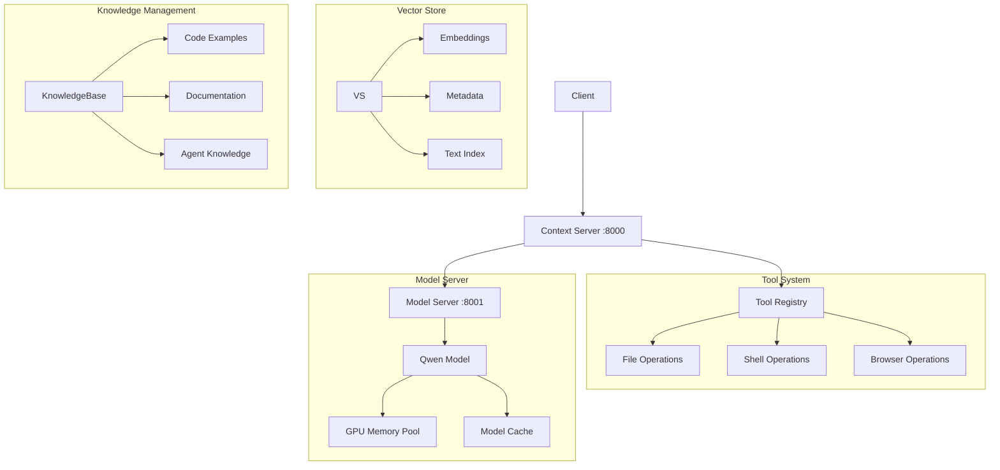

# Qwen Flash Attention with MCP

AI coding assistant powered by Qwen, implementing the Model Context Protocol with tool support.

## Architecture



## Features

### Model Context Protocol
- Full MCP compliance
- Tool support
- Chat completions
- Model information

### Tools
- File operations (read/write)
- Shell command execution
- Browser automation
- Tool registry with validation
- Type-safe parameters

## Setup

1. Install dependencies:
```bash
pip install -r requirements.txt
```

2. Start the server:
```bash
mongod --dbpath ./data
```

3. Start the servers:
```bash
# Start model server
python -m qwen_flash_attention.mcp.model_server

# Start context server (in a new terminal)
python -m qwen_flash_attention.mcp.context_server
```

## API Endpoints

### Model Server (Port 8001)

#### GET /info
Get model information.

Response:
```json
{
    "id": "qwen2.5-coder-1.5b",
    "name": "Qwen2.5-Coder",
    "version": "1.5B",
    "description": "Qwen 2.5 coding model with Flash Attention support",
    "architecture": "Transformer",
    "vocab_size": 32000,
    "max_sequence_length": 2048,
    "parameters": {
        "hidden_size": 2048,
        "num_attention_heads": 32,
        "num_hidden_layers": 24
    }
}
```

#### POST /generate
Generate text from prompt.

Request:
```json
{
    "prompt": "Write a Python function to calculate factorial",
    "temperature": 0.7,
    "max_tokens": 2048
}
```

Response:
```json
{
    "text": "def factorial(n):\n    if n == 0:\n        return 1\n    else:\n        result = 1\n        for i in range(1, n + 1):\n            result *= i\n        return result",
    "usage": {
        "prompt_tokens": 8,
        "completion_tokens": 89,
        "total_tokens": 97
    }
}
```

### Context Server (Port 8000)

#### GET /v1/models
List available models.

Response:
```json
{
    "data": [
        {
            "id": "Qwen2.5-Coder-1.5B-Instruct",
            "object": "model",
            "created": 1700000000,
            "owned_by": "Qwen",
            "permission": ["read", "write"],
            "context_length": 2048
        }
    ]
}
```

### Tool Endpoints

#### GET /v1/tools
List available tools.

Response:
```json
{
    "data": [
        {
            "name": "readFile",
            "description": "Read contents of a file",
            "parameters": [
                {
                    "name": "path",
                    "type": "string",
                    "description": "Path to the file",
                    "required": true
                }
            ],
            "returns": {
                "type": "string",
                "description": "File contents"
            }
        }
    ]
}
```

#### POST /v1/tools/execute
Execute a tool.

Request:
```json
{
    "tool": "readFile",
    "parameters": {
        "path": "/path/to/file"
    }
}
```

Response:
```json
{
    "result": "file contents",
    "error": null
}
```

### Chat Endpoints

#### POST /v1/chat/completions
Create a chat completion with optional tool usage.

Request:
```json
{
    "messages": [
        {
            "role": "user",
            "content": "Read the contents of test.txt"
        }
    ],
    "tools": ["readFile"],
    "temperature": 0.7,
    "max_tokens": 2048
}
```

Response:
```json
{
    "id": "chatcmpl-123",
    "object": "chat.completion",
    "created": 1700000000,
    "model": "Qwen2.5-Coder-1.5B-Instruct",
    "choices": [
        {
            "index": 0,
            "message": {
                "role": "assistant",
                "content": "I'll read the file for you.\n\n```tool\n{\n    \"name\": \"readFile\",\n    \"parameters\": {\n        \"path\": \"test.txt\"\n    }\n}```\n\nHere are the contents of test.txt: [file contents]",
                "tool_calls": [
                    {
                        "name": "readFile",
                        "parameters": {
                            "path": "test.txt"
                        }
                    }
                ]
            },
            "finish_reason": "stop"
        }
    ],
    "usage": {
        "prompt_tokens": 20,
        "completion_tokens": 50,
        "total_tokens": 70
    }
}
```

## Tool Usage

Tools can be used by the model through markdown code blocks:

```tool
{
    "name": "toolName",
    "parameters": {
        "param1": "value1",
        "param2": "value2"
    }
}
```

The model will:
1. Format tool calls in markdown blocks
2. Wait for tool responses
3. Handle tool results appropriately

## Error Handling

The API uses standard HTTP status codes:

- 400: Bad Request (invalid parameters)
- 404: Not Found (tool/model not found)
- 500: Internal Server Error

Error responses follow MCP format:
```json
{
    "message": "Error description",
    "type": "error_type",
    "param": "parameter_name",
    "code": "error_code"
}
```

## Development

### Running Tests
```bash
python -m pytest tests/
```

### Monitoring
```bash
# Monitor GPU usage
nvidia-smi -l 1

# Monitor logs
tail -f qwen_flash_attention.log
```

## License

MIT
